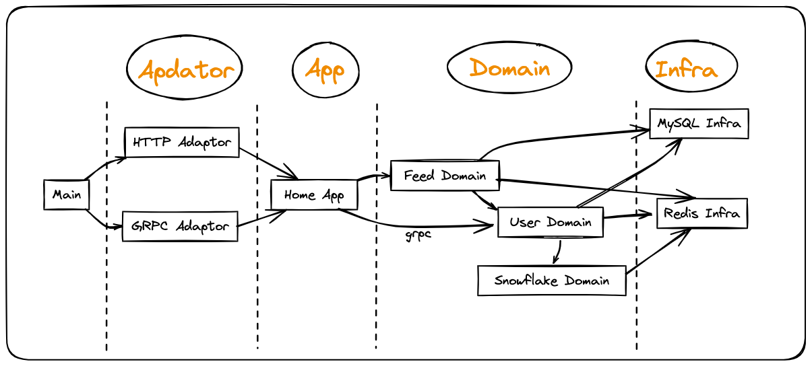
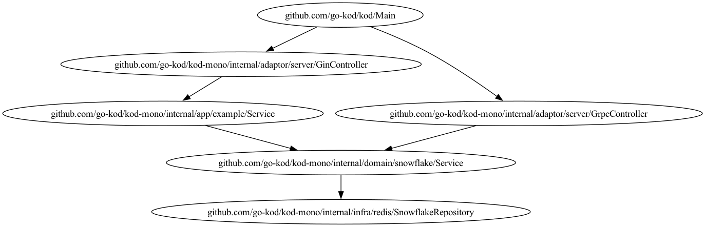
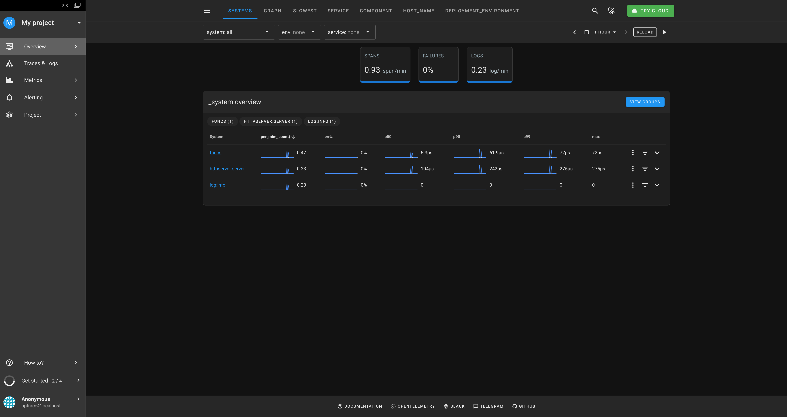
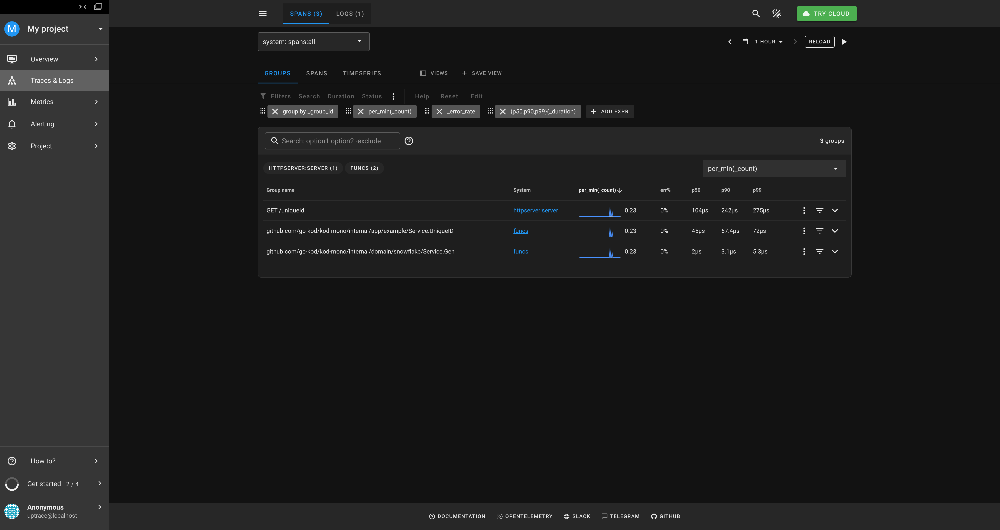
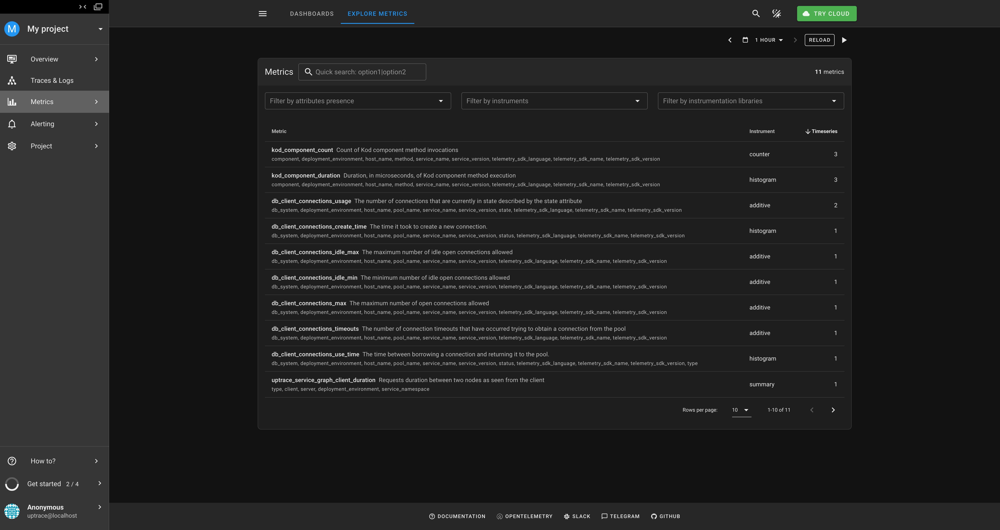

# Kod-Mono

[](https://github.com/go-kod/kod-mono/actions/workflows/go.yml)
[](https://codecov.io/gh/go-kod/kod-mono)

## Features

- Mono Repo Based on Kod
- Support gRPC & HTTP API
- Clean Architecture
- Domain Driven Design
- Unit Test & Integration Test & E2E Test
- Observability with OpenTelemetry & Uptrace

## Domain Driven Design



## CallGraph (Auto Generated)



## Run

### Dependency

```bash
docker-compose -f "deployment/docker-compose.yml" up -d --build
```

### Server

```bash
export OTEL_EXPORTER_OTLP_ENDPOINT="http://localhost:14318"
export OTEL_EXPORTER_OTLP_HEADERS="uptrace-dsn=http://project2_secret_token@localhost:14318?grpc=14317"
export OTEL_EXPORTER_OTLP_COMPRESSION=gzip
export OTEL_EXPORTER_OTLP_METRICS_DEFAULT_HISTOGRAM_AGGREGATION=BASE2_EXPONENTIAL_BUCKET_HISTOGRAM
export OTEL_EXPORTER_OTLP_METRICS_TEMPORALITY_PREFERENCE=DELTA

KOD_CONFIG=./config/server/dev.toml go run ./cmd/server
```

## Try It

```bash
curl http://localhost:9527/uniqueId?name=bob -v
```

```txt
*   Trying 127.0.0.1:9527...
* Connected to localhost (127.0.0.1) port 9527 (#0)
> GET /uniqueId?name=bob HTTP/1.1
> Host: localhost:9527
> User-Agent: curl/8.1.2
> Accept: */*
> 
< HTTP/1.1 200 OK
< Content-Type: application/json; charset=utf-8
< Date: Fri, 31 May 2024 07:06:11 GMT
< Content-Length: 30
< 
* Connection #0 to host localhost left intact
{"Uuid":"1796438007688056832"}%
```

## Uptrace

Visiting [Uptrace](http://localhost:14318/overview/2)

### Overview



### Traces & Logs



### Metrics


